# Individual Dev Blog

So, yeah, this is my (tentative?) "dev blog" for the course [DH2650 Computer Game Design](https://www.kth.se/student/kurser/kurs/DH2650?l=en) at KTH Royal Institute of Technology! I am hosting it here for now, but I plan to code it into a proper blog on my website ([tiago.wtf](https://www.tiago.wtf/)).

| Contents |
| -------- |
| [Entry 0 - First Lecture](#entry-0---first-lecture-%CB%86) |
| [Entry 1 - First Meeting](#entry-1---first-meeting-%CB%86) |
| [Entry 2 - First Pitch](#entry-2---first-pitch-%CB%86) |
| [Entry 3 - Business Plan](#entry-3---business-plan-%CB%86) |
| [Entry 4 - Rerouting](#entry-4---rerouting-%CB%86) |
| [Entry 5 - A Game!](#entry-5---a-game-%CB%86) |

## Entry 0 - First Lecture [ˆ](#individual-dev-blog)

This was a very exciting start. It was very interesting to listen to some of the other students' favorite games -- which I have never played.

I am older than most (or maybe older than everyone?) in my class, and I have two small children. I used to play a lot, but after my oldest son was born (9 years ago), I completely stop playing. Now that he and his sister (who is 7) are bit older, I am sorta getting back to play, but mostly Minecraft, wich they adore.

When I was around 15, I went to the United States for the first time in my life. I was living in my home country, Brazil, and my aunt was taking some of my cousins to Disney World, and I went along. I remember that my father gave me US$ 300 to spend in the trip, and I used it all to buy computer games. That was in the 90s, and some of what would become my favorite games had just been released, such as "X-Com: Ufo Defense", "Sid Meier's Civilization II", "Sid Meier's Colonization" (all three from Microprose), "Warcraft: Orcs and Humans" (Blizzard) and "Indiana Jones and the Fate of Atlantis" (LucasArts). I spent a good part of my life in those games, specially during my bachelor's degree. Fortunately, I had many annoying non-gamer friends that would come to my place and literally take me out of my computer. I remember travelling with them to spend holidays in the countryside, and thinking all the way through the trip about the trade routes I would be starting or where to place my next alien surveillance base when I was back home.

But I have always loved reading as well. Just the last week, I found out that I might be a "literay gamer". I had just finished ["Tomorrow, tomorrow and tomorrow", by Gabrielle Zevin](https://www.goodreads.com/book/show/58784475-tomorrow-and-tomorrow-and-tomorrow) (more on that later), and -- as I usually do, **after** reading a book -- I was reading reviews and interviews about it. I came accross [this piece, in The New York Times](https://www.nytimes.com/2022/07/08/books/review/tomorrow-and-tomorrow-and-tomorrow-gabrielle-zevin.html), by Tom Bissell, that opens like this:

> Most kids who play a lot of video games don’t grow up to become avid readers. Then again, not every kid who reads a lot of books grows up to become an avid reader. Yet, in the diverse taxonomy of the modern gaming audience, there exists the Literary Gamer — someone for whom reading and playing are, and always have been, the same voyage. It would never occur to the Literary Gamer that one activity negates the other. If anything, the Literary Gamer believes, reading and playing enhance systematic thinking and the mysteries of imaginative empathy. This reviewer, for better or worse, is an avowed Literary Gamer — and I call upon my brothers and sisters to join me in a recitation of  Fünke’s Axiom: “There are dozens of us! DOZENS!”

So, that's it. I'm part of the DOZENS. And that's probably why I do like books with lore. :) I will even read books that extend the games' lore!

I guess my favorite genre is Strategy, especially turn-based-strategy games. That includes the whole Civilization series (I started with the very fist one, and played up to the fifth -- I still want to try the latest one, Civilization VI), the Master of Orion series (the second one was amazing), X-Com: UFO Defense (a superb game), the Heroes of Might and Magic series. But also some real-time strategy games, such as the Warcraft series, Age of Empires 2 and Sins of a Solar Empire.

The last game that really absorbed me, before my exile when my son was born, was FTL: Faster Than Light. I remember wanting to play it after reading an [amazing story in PC Gamer magazine about it](https://www.pcgamer.com/ftl-preview-2/). I think it is amazing to see how a graphically simple game can instill such an immersive experience in its players, leading some, like the PC Gamer piece's writer, to even create his own "mini-lore" out of a single play!

This leads to the unavoidable, the one million dollar question: how can we design such a thing?

And that brings me back to "Tomorrow, tomorrow and tomorrow". It's not a perfect book, but it is a story set in the 90s about two friends building a game by themselves. Maybe I like it more than I should for the sheer nostalgia. At some point, one of the characterss something that rang very true (and very close to something Björn said today during the lecture):

> To design a game is to imagine the person who will eventually play it.

And also, by another character, in a different moment:

> You’re a builder of worlds, and if you’re a builder of worlds, your feelings are not as important as what your gamers are feeling. You must imagine them at all times. There is no artist more empathetic than the game designer.

## Entry 1 - First Meeting [ˆ](#individual-dev-blog)

We had a first meeting and, since the schedule is super tight, we've already started discussing and brainstorming ideas. In the end we sorta settled for a rogue-like platformer, slightly nonsensical: a fisherman that can only use a fishing rod as grappling hook for movement. It is still not clear if the character should also move sideways, or if it would move exclusively with the grappling hook. The premise / backstory, on the other hand, is outright nonsensical: the Royal Family (!) established a monopoly on fishing and took all the fish in the ocean (!!) and put them on the top of a tower (!!!!).

I personally think we have a lot of room for creativity with such a starting point. From our first introductions, it seems that we have at least two people well experienced with Unity, and it was decided that it would be our development platform of choice. I have no experience whatsoever with game development or Unity. I would like to get my hands dirty, but at the same time I don’t if it makes sense to start climbing a learning curve now and not be able to make any difference in the project (programming-wise).

## Entry 2 - First Pitch [ˆ](#individual-dev-blog)

For the first pitch presentation, I created an “elevator pitch”:

> Armed only with his faithful fishing rod and his wits, a lone fisherman defies the Royalty and an unforgiving tower in an epic quest for the ocean's stolen fish.

Other ideas that we matured (somewhat) were:

*	Use fishing rod / grappling hook to move and attack
*	Find upgrades by fishing in each level
*   Enemies try to grab you and throw you back down 

We discussed some inspirations. I particularly think a lot about “Alex Kidd” when I think about this game. I would like a similar aesthetics, but my colleagues suggested something similar to “Alto’s Adventure”. A game with a similar concept (vertical climbing / platformer) is “Jump King”.

Christine will be our designer, and she suggested playing around with the element “water”. David did some early prototyping on Unity.

I was thinking about the “What is special about your game” thing in the first pitch presentation template. I think we have a quirky premise, with na unexpected hero, and that the story and all these game components that we’re thinking about (water, tower, fishes, climbing, grappling hook, royalty) are very generative design elements that leave a lot of room for playfulness, creativity and sheer fun.

Let’s see!

## Entry 3 - Business Plan [ˆ](#individual-dev-blog)

Many things are still open in our project. But I guess it's time to dive a bit deeper on the "not-so-fun" parts of the project.

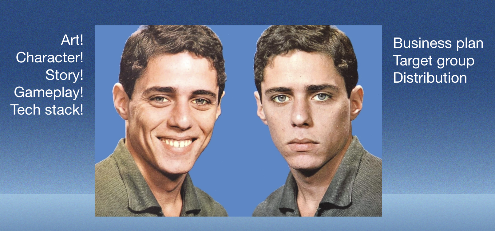

We keep saying that our game will be a "casual game", but then I decided to do some research about what actually that means.

So, [according to wikipedia](https://en.wikipedia.org/wiki/Casual_game), casual games are targeted at a mass market audience (as opposed to a hardcore game, which is targeted at hobbyist gamers). They have simpler rules, shorter sessions, less learned skill, and a fun, simple gameplay. They are expected to have a simple, easy-to-understand user interface, and could be operated with a mobile phone tap-and-swipe interface or a one-button mouse interface. The games are played in short sessions, so a game can be played during work breaks, while on public transportation, or while waiting in a queue anywhere. Often they have familiar visual elements, like playing cards or a Match 3 grid of objects (think Bejewelled, candy crush…).

### The market for Casual Games

[Statista provides a very interesting report about the market for casual games](https://www.statista.com/outlook/dmo/app/games/casual-games/). Some of the main charts:

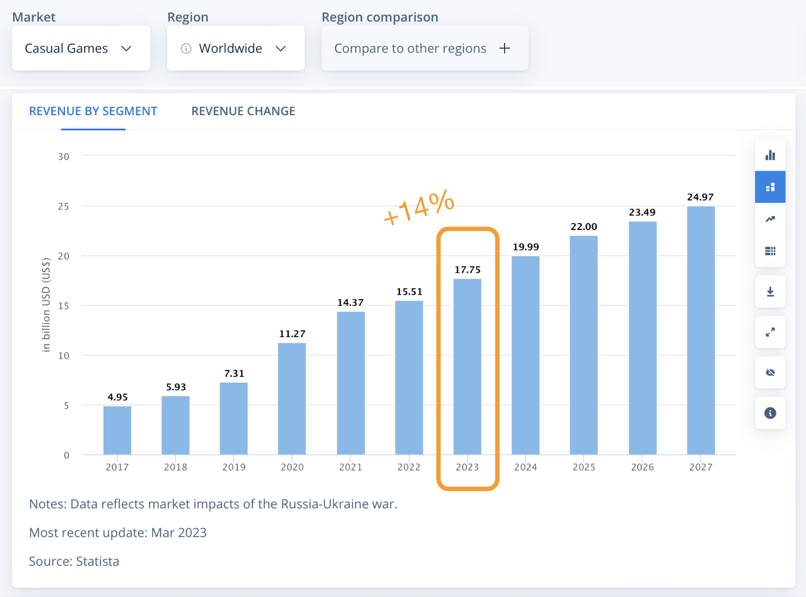
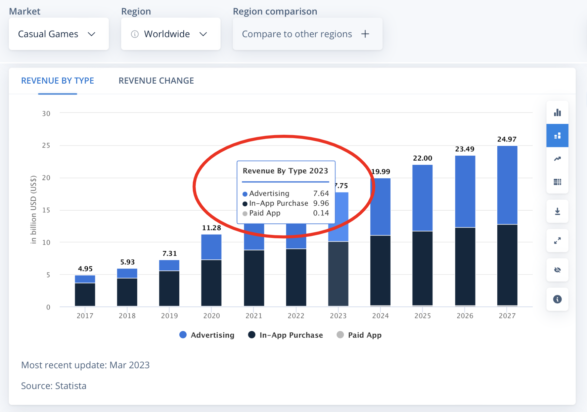

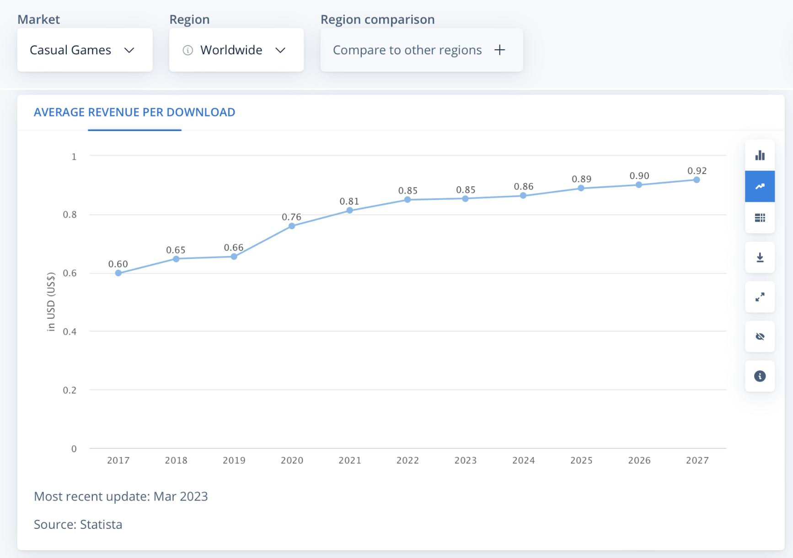
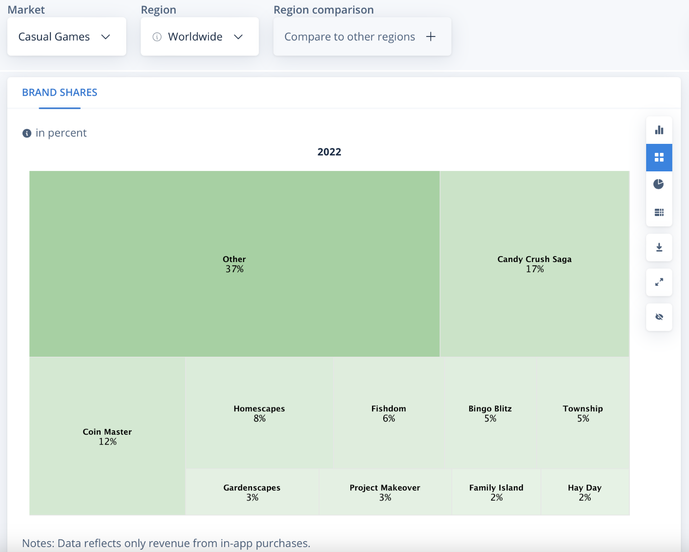

The main takeaways are:

* Overcrowded market, our game needs to stand out
* Ads are a very important source of revenue, we need to rethink our initial plan of one-time purchase.
* In-app purchases are the most important source of revenue, but it is not an option we will consider, on principle
* Porting the game to the web platform may be important: virtually no friction, immediate access to the game, easier access to ads
* Solid web / social media presence to attract users and build an audience
* Come up with creative, fun invitation mechanisms to encourage word of mouth marketing

## Entry 4 - Rerouting [ˆ](#individual-dev-blog)

After a supervision session with Björn, we realized we were, err... a bit lost regarding many aspects of the came. 

We discussed after the Status Update presentation that maybe we were going for a too casual game, and maybe that was not the goal in the first place.

So we are reframing our target group to aim for Indie Games enthusiasts. That means players of any age, willing to try games with different, experimental, innovative gameplay. So we imagine our game being played on a PC at home, with playing sessions of 15-30 minutes, a few days a week.

## Entry 5 - A Game! [ˆ](#individual-dev-blog)

Our last supervision was a bit of a cold shower, when Björn made us realize we still hadn't some key aspects of the game well defined. Specially the enemies. We worked really hard on the days leading to the final presentation to get the game straight.

In the end, we decided the game would have two modes: 

**Regular**: climb each section of the tower, fight the bosses, until you reach the very top of the tower.

**Speedrun**: play on speedrun mode, with no enemies, and challenge your friends to climb as fast as possible

We made some sketches on how the enemies should work, since they were not implemented on the demo.

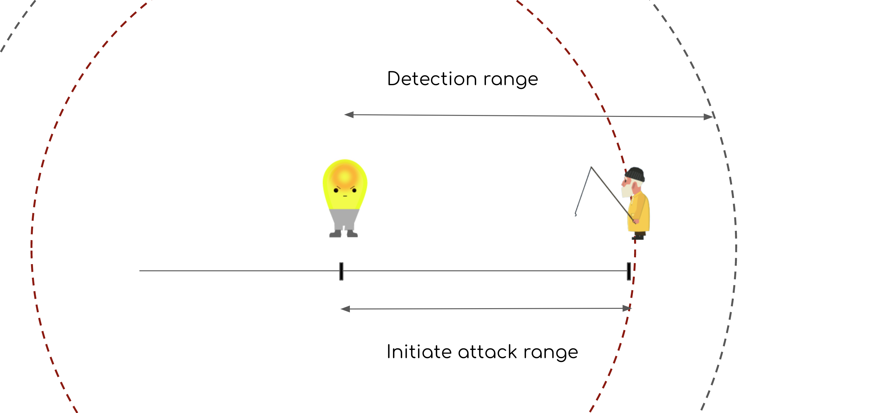

We settled on the number of levels and how they should be implemented. After going back and forth with the idea of multiple towers / multiple settings, we settled on multiple towers on top of each other, each with a distinctive artwork.

I finally some of my expertise and built the game website.

This was a very interesting journey. I wish I had more details about the course beforehand, so I could prepare myself properly (getting acquainted with some of the available game development platforms) in order to contribute more to the actual game programming. But it was interesting simulating in some scale the endevour of developping a game in a team, with its conflicts, disagreements, but also its cooperation e collaboration.

To finalize, a gameplay video of our game:

---
## Random, to organize, edit, search etc.

### To read:

https://www.newyorker.com/books/page-turner/on-video-games-and-storytelling-an-interview-with-tom-bissell

### Books

"A Theory of Fun for Game Design" (and the [companion website](https://www.theoryoffun.com/))

From "Tomorrow..."'s notes:

> Although my parents both worked in computers and I am a lifelong gamer, these sources were particularly helpful to my thinking about and understanding of 1990s- and 2000s-era game culture and designers: Blood, Sweat, and Pixels: The Triumphant, Turbulent Stories Behind How Video Games Are Made, by Jason Schreier; Masters of Doom: How Two Guys Created an Empire and Transformed Pop Culture, by David Kushner; Hackers: Heroes of the Computer Revolution (specifically the section on Sierra On-Line), by Steven Levy; A Mind Forever Voyaging: A History of Storytelling in Video Games, by Dylan Holmes; Extra Lives: Why Video Games Matter, by Tom Bissell; All Your Base Are Belong to Us: How Fifty Years of Video Games Conquered Pop Culture, by Harold Goldberg; and the documentaries Indie Game: The Movie, directed by James Swirsky and Lisanne Pajot, and GTFO, directed by Shannon Sun-Higginson. I read Indie Games by Bounthavy Suvilay after I finished writing, and it’s a beautiful book for those looking to see how artful games can be.

### Random notes

Uncharted Waters (New Horizons), Koei

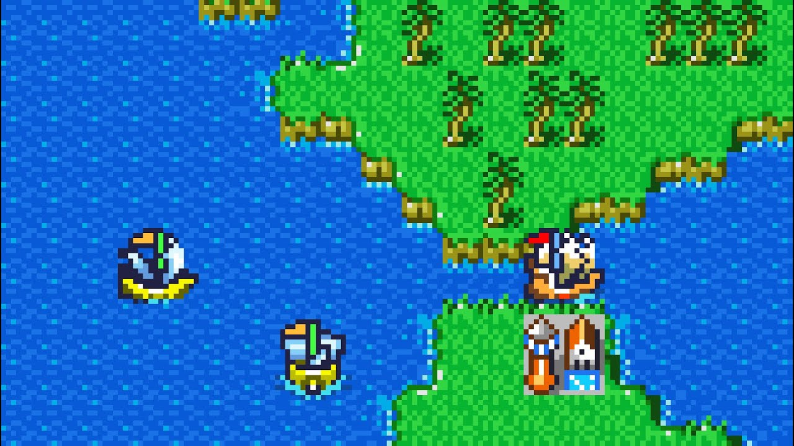

X-Com: Ufo Defense

One of the most terrifying scenes of my youth... investigating a UFO crash site in the dark.

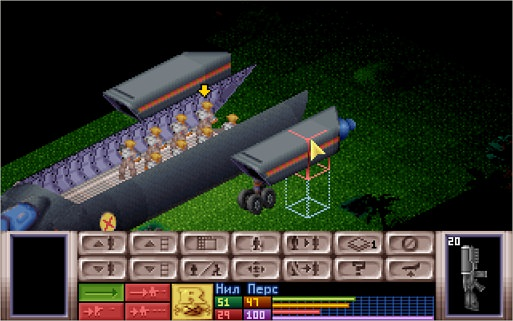

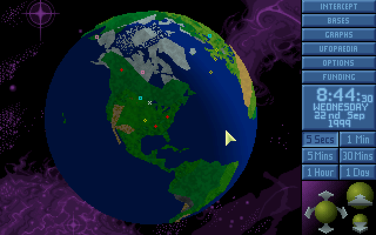

Why XCOM: UFO Defense Is My Favorite Game Of All-Time (Dan Stapleton)

https://www.youtube.com/watch?v=KV50XHrabbs

Civilization

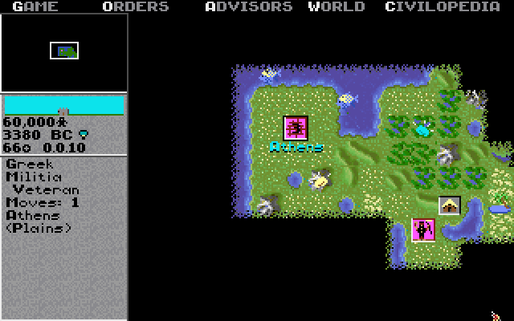

Phantasy Star

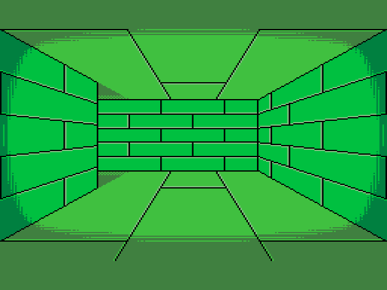
